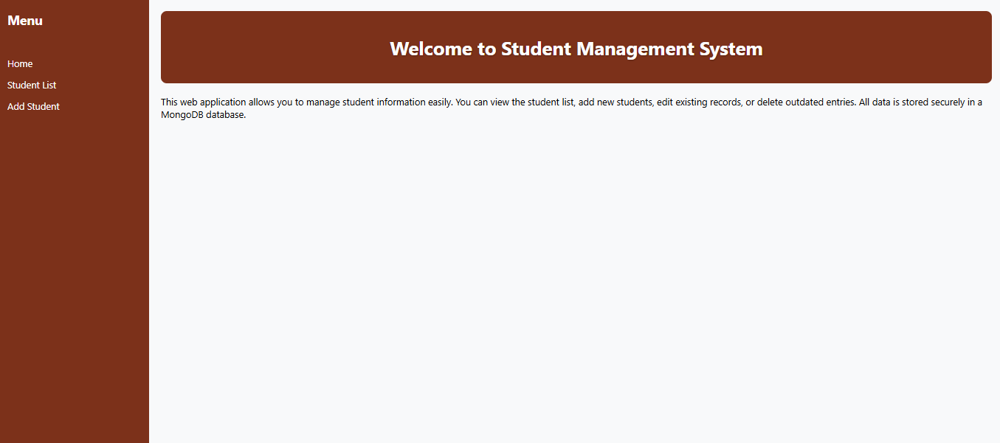
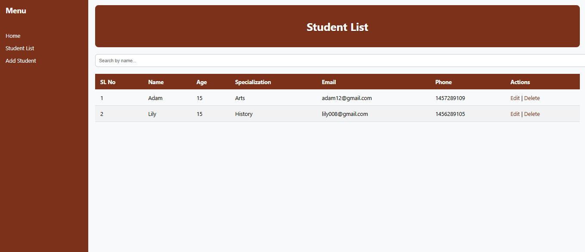
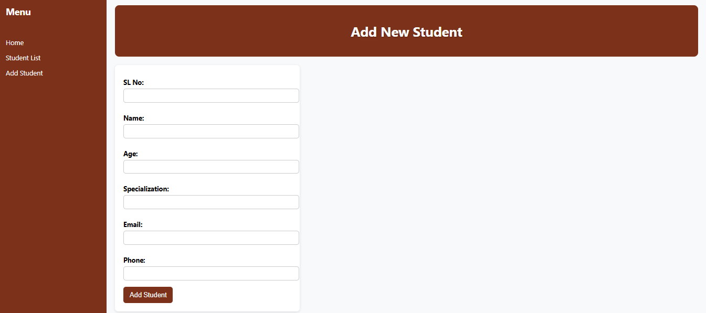

# Student Management System - Web Development CRUD App

A simple **CRUD (Create, Read, Update, Delete) web application** built with **Node.js, Express, MongoDB, and EJS**.  
It allows managing student records including adding, editing, viewing, and deleting students.

---

## Features

- **Home Page:** Brief description of the application  
- **Student List:** View all students with details:
  - SL No
  - Name
  - Age
  - Specialization
  - Email
  - Phone Number
- **Add Student:** Add a new student with all details  
- **Edit Student:** Update existing student information  
- **Delete Student:** Remove a student from the database  
- **Search:** Search students by name  
- **Responsive Design:** Works on desktop and mobile  

---

## Technology Stack

- Node.js  
- Express.js  
- MongoDB Atlas  
- EJS (Embedded JavaScript templates)  
- CSS (Brown theme with sidebar and table formatting)  

---

## Screenshots

1. **Home Page**  

2. **Student List**  

3. **Add Student**  

